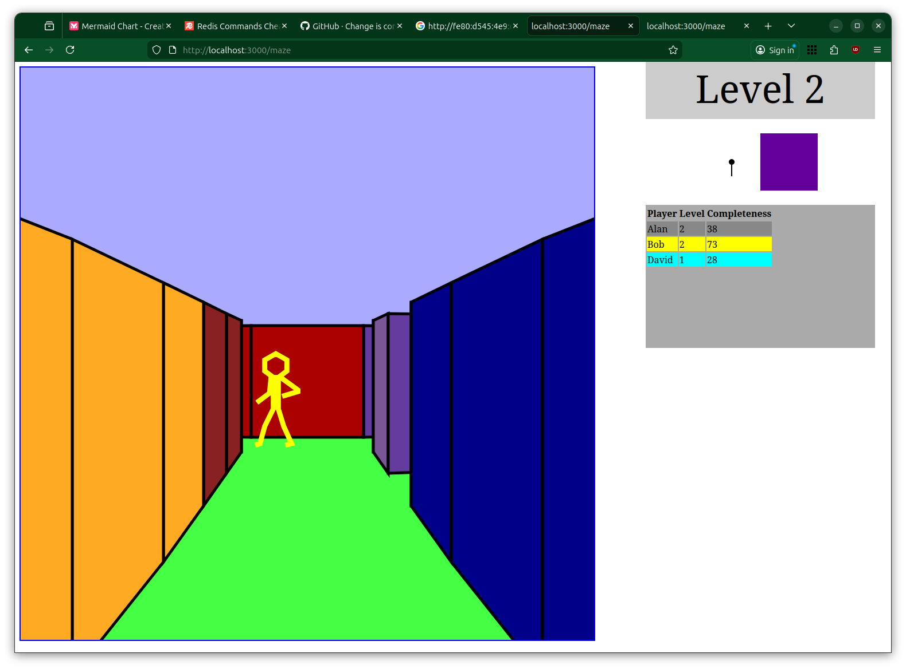

# MAZE 3D

## About:

This was a "simple" demonstration of trigonometry for my eldest son when he started doing high school math. My yongest son then started throwing out "suggestions" and "ideas" to make the game more fun to play.

This is a 3D MAZE game. Find your way out of the maze, get to the next and larger level. Originally this was a single file HTML/JS single player "game".


After feedback from the "user community":
- multiplayer was added, 
- a real time leaderboard, 
- various partly finished power-ups. 
- other players are visible in the maze when in line of sight. 

Cheat codes:
- dad4tw - show map of maze
- freeze - detonate freeze bomb - Other players are briefly frozen in place
- buhbye - send opponents back to the start of the level

The map is visible at the start of the level, and when a player is in a dead end.

[]

## Install

Maze3d requires node.js and npm to be installed and runs on a browser. Use npm to install dependencies:

```bash
npm install
```

## Running 

### Start Server

```bash
node index.js
```

### In browser

Open `http://localhost:3000/maze` in the browser.

Other players can join using the ip address of the computer running the node server e.g.

Open `http://<node server ip>:3000/maze` in the browser of remote device

### Disclaimer:

There is no security in this game. Anybody can join the game by knowing the ip address of the server.